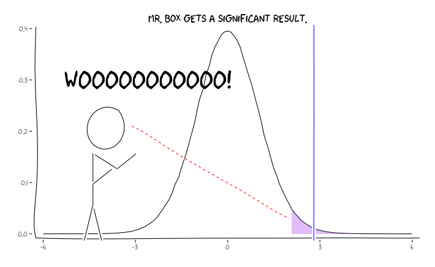

```{r setup, include=FALSE}
knitr::opts_chunk$set(echo = TRUE)
```

## The Multiple Testing Problem

* In statistics, you learned about hypothesis tests and P-values
* What was definition of P-value again?
* What is the problem of running 100 different hypothesis tests?

## Problem of "P-hacking"

* If one performs many hypothesis tests, one is bound to find some that have a P-value < 0.05 by chance
* "P-hacking": keep generating hypotheses until P<0.05, then publish results
* Particularly problematic in genomics: sometimes tbousands or even millions of hypothesis tests are performed in parallel
* Need approach for avoiding "p-hacking" or multiple testing problem

## Simple Approach: Multiple P-values by N

* Idea: for n hypothesis tests, muliply each P-value by n
* Bonferroni correction
* Problem: too conservative: P-values become very large, interesting tendencies may be missed

## False Discover Rate

* Control rate of false positives 

## P-value

```{r echo=FALSE}

```


## Type I and Type II Error Rate

* Alpha: Type I error rate (chance of falsely reported findings)
* Beta: Type II error rate (chance of missed findings)
* Power: 1-beta: How sure are we to detect true case?

```{r echo=FALSE}

```

<https://stats.stackexchange.com/questions/148603/how-should-an-individual-researcher-think-about-the-false-discovery-rate>

## False Discovery Rate

Determine rate at which a significant result is actually false

```{r echo=FALSE}

```

## FDR and Power

```{r echo=FALSE}

```


