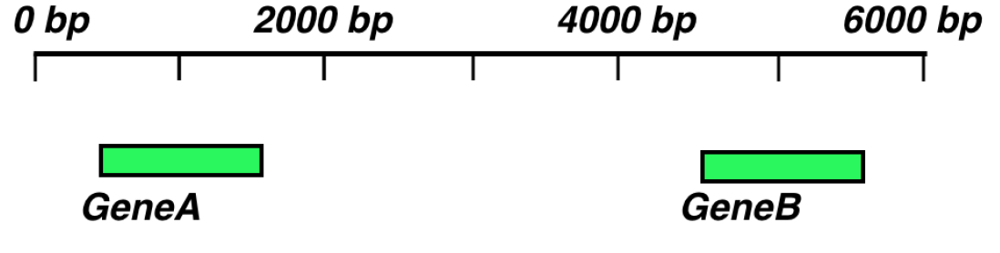

```{r setup, include=FALSE}
knitr::opts_chunk$set(echo = TRUE,message=FALSE, warning=FALSE)
```

## How can one find "new genes"?

```{r echo=FALSE}

```

* Let's look at some data!
* Data and code from R Bioinformatics Cookbook by Dan McLean

## Preliminaries

```{r}
if (!require("Rsamtools")) {
  BiocManager::install("Rsamtools")
}
library(Rsamtools)
if (!require("bumphunter)")) {
  BiocManager::install("bumphunter")
}
library(bumphunter)
```

## Downloading Data

```{r}
# original: file.path(getwd(), "datasets", "ch1", "windows.bam"),
urldir <- "https://raw.githubusercontent.com/PacktPublishing/R-Bioinformatics-Cookbook/master/datasets/ch1"
bamname <- "windows.bam"
bainame <- "windows.bam.bai"
if (!file.exists(bamname)) {
  download.file(file.path(urldir,bamname),bamname)
}
if (!file.exists(bainame)) {
  download.file(file.path(urldir,bainame),bainame)
}

```

## Creating "Pileups"

```{r}
library(ggplot2)
library(dplyr)
pileup_df <- Rsamtools::pileup(bamname)
knitr::kable(head(pileup_df))
```


## Plotting Coverage Plots

```{r}
pileup_df %>% ggplot(aes(x=pos,y=count)) + geom_line()
```

## Finding Clusters

The function `clusterMaker` assigns an integer value to each position:

```{r}
clusters <- bumphunter::clusterMaker(pileup_df$seqnames,pileup_df$pos, maxGap = 100)
knitr::kable(table(clusters))
```

## Plotting Coverage Plots

```{r}
pileup_df$clusters <- as.factor(clusters)
pileup_df %>% ggplot(aes(x=pos,y=count)) + geom_line(aes(colour=clusters))
```

## Exercise

The "clusters" is a long integer vector
Convert it using Rle and table to something more intepretable
How many clusters are there? What integer values are assigned to them?
How long are the regions?


## Find Regions with Cutoffs

```{r}
bumphunter::regionFinder(pileup_df$count, pileup_df$seqnames,
pileup_df$pos, clusters, cutoff=1)
```

## Exercise:

How many regions are there?
Plot the regions together with the original coverage plot

## Visualizing RNA-Seq Results

```{r}
library(DESeq2)
library(magrittr)
library(ggplot2)
ddsname <- "modencode_dds.RDS"
if (!file.exists(ddsname)) {
  download.file(file.path(urldir,ddsname),ddsname)
}
dds <- readRDS(ddsname)
dds
```
```{r}
result_df <- results(dds, contrast = c("stage", "L2Larvae","L1Larvae"), tidy=TRUE) 
stopifnot(is.data.frame(result_df))
```


## Expression Result Table

```{r}
knitr::kable(head(result_df))
```

## Filtering Out Non-Significant Rows

Require adjusted P value < 0.05

```{r}
result_df <- result_df %>% mutate(is_significant=(padj < 0.05))
# modern notation: result_df <- result_df %>% filter(padf < 0.05)
```

## Plotting fold change versus mnea of base case (MA-Plot)

```{r}
ggplot(result_df, aes(x=baseMean, y=log2FoldChange)) + geom_point(aes(colour=is_significant))
```

## Volcanoe Plot

```{r}
ggplot(result_df, aes(x=log2FoldChange, y=(-1*log10(pvalue)))) + geom_point(aes(colour=is_significant))
```
